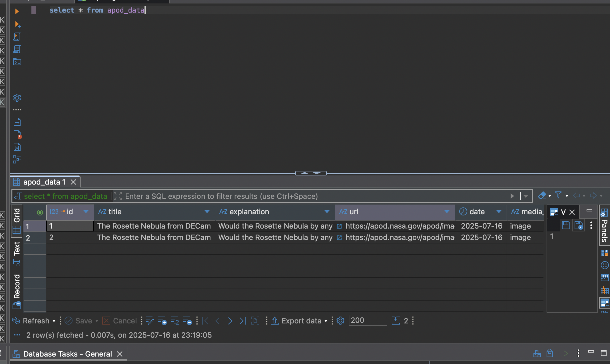
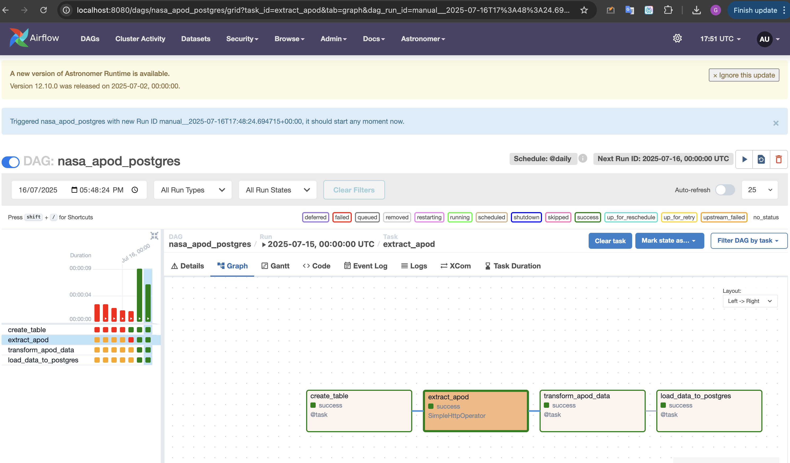

### Project Overview: Airflow ETL Pipeline with Postgres and API Integration

This project involves creating an ETL (Extract, Transform, Load) pipeline using Apache Airflow. The pipeline extracts data from an external API (in this case, NASA's Astronomy Picture of the Day (APOD) API), transforms the data, and loads it into a Postgres database. The entire workflow is orchestrated by Airflow, a platform that allows scheduling, monitoring, and managing workflows.

The project leverages Docker to run Airflow and Postgres as services, ensuring an isolated and reproducible environment. We also utilize Airflow hooks and operators to handle the ETL process efficiently.

Key Components of the Project:
Airflow for Orchestration:

Airflow is used to define, schedule, and monitor the entire ETL pipeline. It manages task dependencies, ensuring that the process runs sequentially and reliably.
The Airflow DAG (Directed Acyclic Graph) defines the workflow, which includes tasks like data extraction, transformation, and loading.
Postgres Database:

A PostgreSQL database is used to store the extracted and transformed data.
Postgres is hosted in a Docker container, making it easy to manage and ensuring data persistence through Docker volumes.
We interact with Postgres using Airflow’s PostgresHook and PostgresOperator.
NASA API (Astronomy Picture of the Day):

The external API used in this project is NASA’s APOD API, which provides data about the astronomy picture of the day, including metadata like the title, explanation, and the URL of the image.
We use Airflow’s SimpleHttpOperator to extract data from the API.
Objectives of the Project:
Extract Data:

The pipeline extracts astronomy-related data from NASA’s APOD API on a scheduled basis (daily, in this case).
Transform Data:

Transformations such as filtering or processing the API response are performed to ensure that the data is in a suitable format before being inserted into the database.
Load Data into Postgres:

The transformed data is loaded into a Postgres database. The data can be used for further analysis, reporting, or visualization.
Architecture and Workflow:
The ETL pipeline is orchestrated in Airflow using a DAG (Directed Acyclic Graph). The pipeline consists of the following stages:

1. Extract (E):
   The SimpleHttpOperator is used to make HTTP GET requests to NASA’s APOD API.
   The response is in JSON format, containing fields like the title of the picture, the explanation, and the URL to the image.
2. Transform (T):
   The extracted JSON data is processed in the transform task using Airflow’s TaskFlow API (with the @task decorator).
   This stage involves extracting relevant fields like title, explanation, url, and date and ensuring they are in the correct format for the database.
3. Load (L):
   The transformed data is loaded into a Postgres table using PostgresHook.
   If the target table doesn’t exist in the Postgres database, it is created automatically as part of the DAG using a create table task.

# ETL Pipeline

This project is an ETL (Extract, Transform, Load) pipeline built using Apache Airflow. The pipeline fetches APOD images/data for a from https://api.nasa.gov/ and processes it for further use.

---

## postgres scenes

---

## airflow UI scenes

---

# Project setup

1. clone the repository
2. make sure airflow and astronomer is installed on your pc otherwise complete the astro and airflow installation
3. run "astro dev start" - it will start the docker containers and a server at localhost 8080 port where airflow UI can be seen.
4. In the airflow UI --> admin -> connections :
   setup your connection for :

   1. postgres
      connection id = my_postgres_connection (as in etl.py),
      connection type = postgres,
      Host = postgres,
      Login = postgres,
      password = postgres

   2. astronomer picture of the day - (take your api_key from https://api.nasa.gov/)
      connection id = nasa_api (as in etl.py),
      connection type = http,
      extra = {"api_key":"your_api_key"}

### Note : If airflow UI showing page for login -

username = admin ,
password = admin

You can configure it by yourself as per your choise
